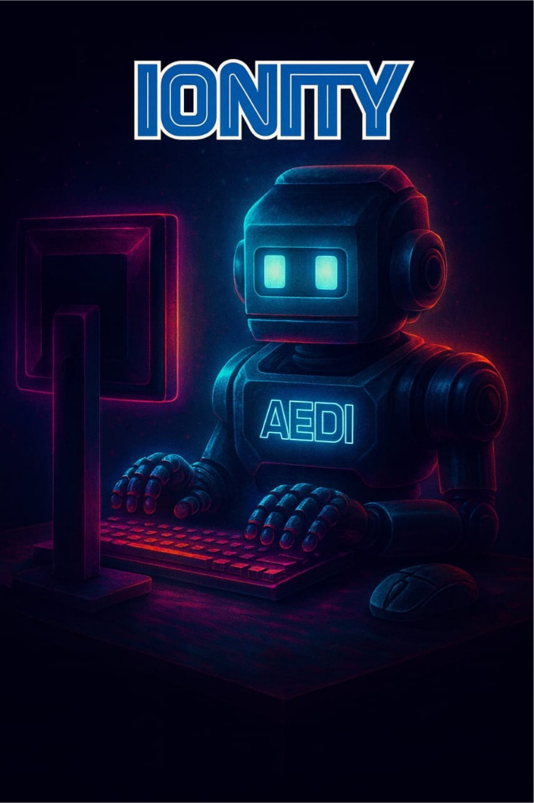

# IonityEdge · K10

**True Edge AI for the UNIHIKER K10 (ESP32-S3) — the board is the face, your machine is the brain.**

> _Building Tomorrow, Today._ · Anything is Possible with God.
> An open-source **Ionity Global** project under **Policy 986 AED** · Licensed **CC BY-SA 4.0**.



---

## 1. What this is

**IonityEdge · K10** turns a [DFRobot UNIHIKER K10](https://www.unihiker.com/products/k10) into a
**thin, WiFi-connected front-end** for a powerful **local Edge Brain** that runs on your own
computer (or a mini-PC / Jetson / the upcoming Ionity **AI-M** board). The K10 shows the UI,
reads its sensors, and streams camera + microphone data; the Edge Brain does the heavy lifting —
OCR, voice, mood, vision, reasoning, and a semantic cache — **with no cloud and no API keys**.

This mirrors the Ionity **AEDI** philosophy: the K10 is a *node*; the Edge Brain is the
*ecosystem* it plugs into. Like an NVIDIA-style edge deployment, the small device borrows the
big machine's resources over WiFi, so it can do far more than 512 KB of SRAM ever could alone.

| Layer | Runs on | Role |
|------|---------|------|
| **K10 front-end** | ESP32-S3 (this repo's `firmware/`) | Screen, buttons, sensors, camera+mic streaming, WiFi |
| **Edge Brain** | Your PC / mini-PC / Jetson / AI-M (`edge-server/`) | Local models + Claude-desktop bridge + semantic cache |
| **Installer** | Any browser (`installer/`) | Flash the board, set WiFi, manage everything |

## 2. Capabilities (v1 — everything on)

- 👁 **Vision** — face / object / QR recognition, plus **OCR** of on-screen and camera text.
- 🎙 **Voice** — mic **wake-word**, speech-to-text, text-to-speech reading, and **mood / emotion** detection.
- 🌡 **All sensors** — temperature, humidity, ambient light, 3-axis motion streamed as live telemetry.
- 📍 **Geolocation** — WiFi-based positioning for the moving device (no GPS needed).
- 💾 **Recording** — session, screen and audio capture to the microSD card, streamed off-device.
- 🧠 **Semantic cache** — repeated questions answer instantly and keep working offline.
- 🤝 **Hybrid brain** — local open models for realtime work; a **Claude-desktop bridge** (your Google
  login, your subscription, **no API key**) for heavy reasoning when your PC is on.
- 🔔 **Smart Notify + Ads module** — on-device notices and an opt-in, brand-safe ad surface.
- 🪪 **Metadata & provenance** — every capture is stamped with AEDI / Policy 986 provenance.

## 3. Quick start (three commands)

```bash
# 1) Bring up the Edge Brain (your PC) — pulls local models on first run
cd edge-server && ./scripts/setup.sh        # Windows: .\scripts\setup.ps1
python -m app.main

# 2) Open the Installer (flash + configure the K10 from your browser)
cd installer && npm install && npm run dev   # then open http://localhost:5173

# 3) Flash the board (or use the Installer's one-click WebSerial flasher)
cd flasher && ./flash.sh                      # Windows: .\flash.ps1
```

The Installer walks you through **WiFi provisioning** (SSID `Antwerp Ionity`), pairing the board
to the Edge Brain, and turning features on/off. WiFi credentials are written to the board's secure
NVS store by the Installer — **never committed to this public repo**.

## 4. Repository layout

```
ionity-k10-edge/
├── docs/            Architecture, hardware map, security, roadmap, PLAN
├── firmware/
│   ├── arduino-unihiker/  PlatformIO C++ — LIVE sensory-frontend node (HTTP /ingest) ★
│   ├── arduino/           WebSocket thin-client scaffold (v2 rich-media — experimental)
│   └── micropython/       MicroPython demo scripts (education / tinkering)
├── edge-server/     FastAPI "Edge Brain" — local models + Claude bridge + semantic cache
├── installer/       React (Vite) app — flashing, WiFi, dashboard, all controls
├── flasher/         One-click flash scripts (esptool / PlatformIO)
├── tools/           Branding extractor + GitHub push helper
└── .github/         CI
```

## 5. Hardware — UNIHIKER K10

ESP32-S3 (Xtensa LX7) · 512 KB SRAM · 16 MB flash · 2.8″ 320×240 IPS · 2 MP camera ·
dual-mic array · speaker · temp/humidity/light/accelerometer · microSD · WiFi 2.4 G + BT 5.0 ·
on-device TinyML. See [`docs/HARDWARE-MAP.md`](docs/HARDWARE-MAP.md).

## 6. Documentation

- [`docs/PLAN.md`](docs/PLAN.md) — the full build plan (planning mode output)
- [`docs/ARCHITECTURE.md`](docs/ARCHITECTURE.md) — system + data-flow architecture
- [`docs/HARDWARE-MAP.md`](docs/HARDWARE-MAP.md) — pins, sensors, streaming budget
- [`docs/SECURITY.md`](docs/SECURITY.md) — secrets, encryption, provisioning
- [`docs/ROADMAP.md`](docs/ROADMAP.md) — v1 → v3 milestones

## 7. License & rights

© 2018–2026 **Ionity (Pty) Ltd** / Antwerp Designs — Johan Wilhelm van Antwerp.
Released open-source under **Creative Commons Attribution-ShareAlike 4.0 (CC BY-SA 4.0)**,
governed by **Policy 986 AED**. See [`LICENSE`](LICENSE) and [`POLICY-986.md`](POLICY-986.md).
Ionity logos and brand marks remain Ionity property (TM²) — reuse the code freely, credit the author.

**Contact:** info@ionity.today · www.ionity.today · www.ionity.world · www.ionity.co.za
