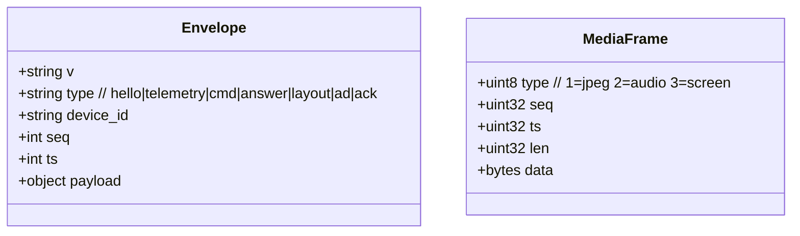
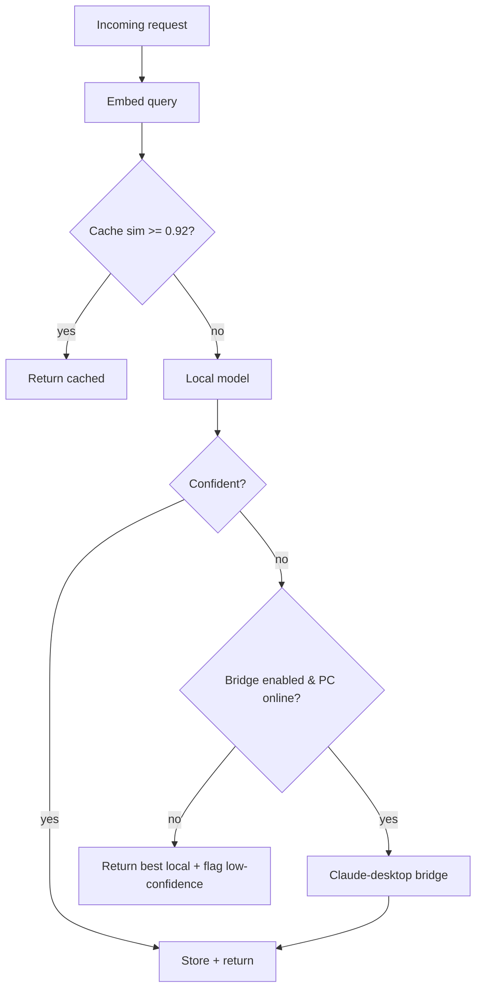

<!-- INTERNAL · IonityEdge · K10 · POL 986 AED -->

# Architecture

> **Doc ID:** DOC-2026-07-K10-002 · **Version:** V0.1 · Policy 986 AED

## 1. Principles

1. **Thin edge, fat brain.** The K10 never runs inference; it senses, renders, and streams.
2. **Local first.** Everything works on your LAN with open models; cloud is never required.
3. **Hybrid intelligence.** Local models for realtime; Claude-desktop bridge for heavy reasoning.
4. **Provenance always.** Every artefact carries an AEDI/Policy 986 stamp.

## 2. Transport & protocol

### 2.1 Live path — HTTP `/ingest` (primary, shipping today)

The on-device firmware (`firmware/arduino-unihiker`) is a pure sensory frontend. Every ~300 ms it
**POSTs its sensor upload** to the Edge Brain and the server **returns the exact render** to display:

```
POST /ingest
  {device_id, telemetry:{temp_c,humidity,light,sound,level,ip, aps?:[{bssid,rssi}]}}
→ {ok, state:{color,mood,label,level,radius,leds[], brightness,fps_ms, say?}}
```

- The server (`app/orb.py:compute`) owns mood→colour→LED→brightness→fps. The device never decides
  colour — one source of truth, live-tunable from localhost via `/api/orb-config` with **no reflash**.
- Optional `aps` (a periodic WiFi scan) feeds local BSSID geolocation (`app/location/geolocate.py`).
- The dashboard and installer mirror the same `state` from `/api/live` and `/api/devices`.

### 2.2 Rich-media path — WebSocket `/device` (v2 roadmap)

For camera/audio/screen streaming a single **WebSocket** carries two logical channels
(`app/ws/device_gateway.py`, `firmware/arduino` scaffold):

- **Control channel (JSON):** handshake, capability list, sensor telemetry, commands, answers,
  screen layouts, ad/notify payloads.
- **Media channel (binary):** length-prefixed frames — `0x01` JPEG camera, `0x02` Opus/PCM audio,
  `0x03` screen capture. Frames carry a 12-byte header `[type|seq|ts|len]`.



### Handshake
1. K10 → `hello` with `device_id`, firmware version, capability flags, screen size.
2. Brain → `hello_ack` with enabled features, model set, sample rates, ad policy.
3. Steady state: K10 streams telemetry + media; Brain streams answers/layouts/ads.
4. Heartbeat every 5 s; auto-reconnect with backoff.

## 3. Brain routing logic



## 4. Module map

| Path | Responsibility |
|---|---|
| `edge-server/app/ws/device_gateway.py` | WebSocket lifecycle, frame demux |
| `edge-server/app/brain/orchestrator.py` | Pipeline: STT→route→answer→TTS |
| `edge-server/app/brain/router.py` | Cache/local/bridge decision |
| `edge-server/app/models/*` | STT, TTS, OCR, vision, mood, local LLM adapters |
| `edge-server/app/bridge/claude_desktop.py` | Local Claude relay (no API key) |
| `edge-server/app/cache/semantic_cache.py` | Embedding index + store |
| `edge-server/app/location/geolocate.py` | WiFi BSSID → coordinates |
| `edge-server/app/recording/recorder.py` | Session/screen/audio persistence |
| `edge-server/app/ads/ad_engine.py` | Opt-in local ad slots |
| `edge-server/app/telemetry/sensors.py` | Sensor fusion + alerts |
| `edge-server/app/meta/provenance.py` | AEDI/Policy 986 stamping |
| `edge-server/app/orb.py` | Server-side render: mood→colour→LEDs→brightness→fps |
| `firmware/arduino-unihiker/src/main.cpp` | **Live** sensory-frontend node (HTTP `/ingest`) |
| `firmware/arduino/src/*` | WS thin-client scaffold (v2 rich-media roadmap) |
| `installer/src/*` | Flash, provision, dashboard, controls |

## 5. Portability to AI-M / Jetson

The Edge Brain is pure Python with pluggable adapters. Moving from a Windows PC to a Jetson or the
Ionity **AI-M** board means: install the runtime, point model adapters at the local accelerator,
and set the same LAN address in the installer. The K10 firmware is unchanged.

_© Ionity (Pty) Ltd · Policy 986 AED · CC BY-SA 4.0_
