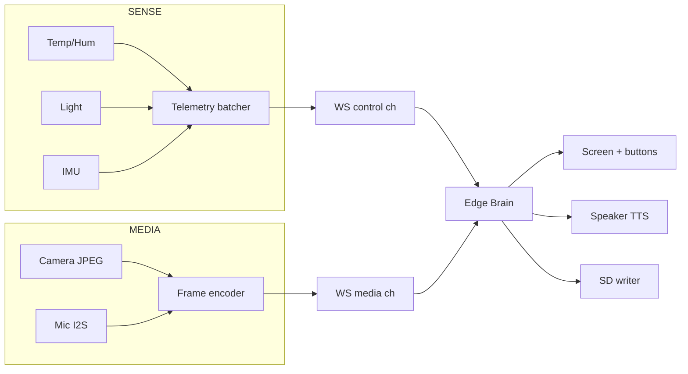

<!-- INTERNAL · IonityEdge · K10 · POL 986 AED -->

# Hardware Map — UNIHIKER K10

> **Doc ID:** DOC-2026-07-K10-003 · Policy 986 AED
> Always confirm against DFRobot's board pinout for your revision:
> https://www.unihiker.com/wiki/K10/ and https://wiki.dfrobot.com/dfr0992-en/

## 1. Core

| Item | Spec |
|---|---|
| MCU | ESP32-S3 (Xtensa LX7 dual-core) |
| SRAM | 512 KB (+ external PSRAM on module) |
| Flash | 16 MB |
| Display | 2.8″ IPS, 320×240 |
| Camera | 2 MP (streamed as JPEG) |
| Microphone | dual-mic array (I2S) |
| Speaker | onboard (I2S DAC) |
| Sensors | temperature, humidity, ambient light, 3-axis accelerometer |
| Storage | microSD (SPI/SDMMC) |
| Radio | WiFi 2.4 GHz b/g/n, BT 5.0 |
| Buttons | onboard A/B + touch; edge connector GPIO |
| TinyML | on-device vision/audio models |

## 2. Front-end responsibilities (firmware)

## 3. Pin configuration

Pins are centralised in [`firmware/arduino/include/hardware_pins.h`](../firmware/arduino/include/hardware_pins.h).
**Values there are placeholders keyed to the K10 defaults — verify against your board revision and
the DFRobot BSP before flashing.** The K10 exposes most peripherals through the board support
package, so prefer the DFRobot/`UNIHIKER` libraries over raw pin access where available.

## 4. Streaming budget (2.4 GHz reality)

| Stream | Default | Rationale |
|---|---|---|
| Sensors | 2 Hz JSON batch | tiny, always on |
| Camera | 320×240 JPEG @ 5–10 fps, adaptive | fits 2.4 GHz; raise on 5 GHz brain link |
| Audio | 16 kHz mono, Opus/PCM 20 ms frames | STT-grade |
| Screen capture | on-demand only | recording/OCR of screen |

Adaptive controller drops camera fps first under congestion; audio + control are prioritised.

## 5. Power / mobility

The device is battery-capable and **moving** — geolocation uses WiFi BSSID scans (no GPS). The
firmware batches scans and lets the brain resolve coordinates, so location survives roaming.

_© Ionity (Pty) Ltd · Policy 986 AED · CC BY-SA 4.0_
