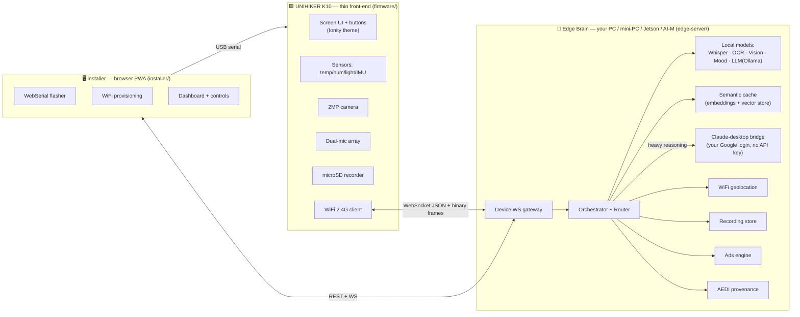
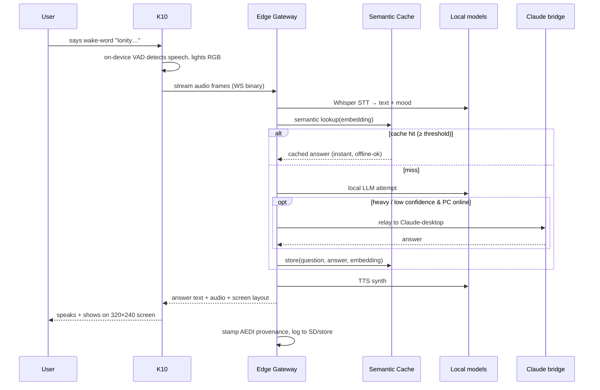
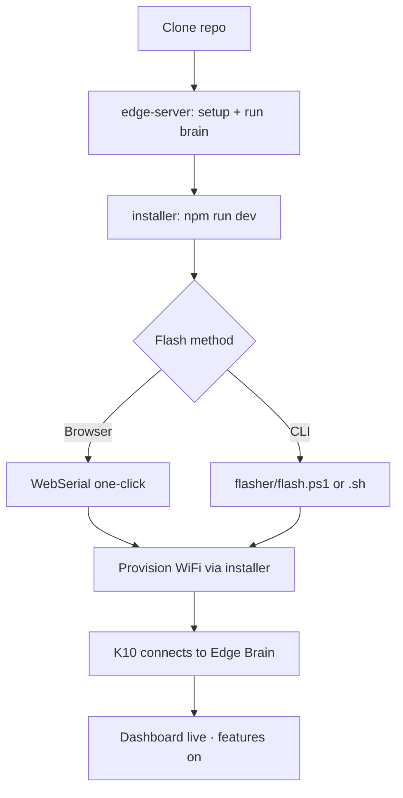

<!-- CONFIDENTIAL — DRAFT — IonityEdge · K10 | IONITY — PROPRIETARY | POL 986 AED -->

# IonityEdge · K10 — Build Plan

> **Classification:** INTERNAL · **Doc ID:** DOC-2026-07-K10-001 · **Version:** V0.1
> **Author:** Johan Wilhelm van Antwerp · **Entity:** Ionity (Pty) Ltd / AEDI · **Governance:** Policy 986 AED

---

## Executive summary

**IonityEdge · K10** makes a UNIHIKER K10 behave like a device many times its size. The K10 is a
**thin WiFi front-end** — screen, buttons, sensors, camera, microphone — and all heavy intelligence
runs on a **local Edge Brain** on your own hardware. No cloud dependency, no API keys, everything
saved locally. This is the AEDI model in miniature: a small **node** drawing on a larger
**ecosystem's** resources over WiFi, exactly as an NVIDIA-class edge box offloads to a server.

The brain is **hybrid**: fast open-source models handle realtime work (wake-word, OCR, vision,
sensor fusion, mood) with zero external dependency, while an optional **Claude-desktop bridge**
(your Google login, your subscription — *not* an API key) handles heavy reasoning when your PC is
on. A **React installer** flashes the board, provisions WiFi, and controls every feature.

> ◆ **Directive:** The K10 must remain a *front-end only*. Any capability that cannot fit in
> 512 KB SRAM lives on the Edge Brain and is reached over WiFi. This keeps the board cheap,
> cool, and replaceable while the intelligence scales independently.

---

## 1. Goals & non-goals

| # | Goal | Success criterion |
|---|------|-------------------|
| G1 | K10 as thin client | Board boots, joins WiFi `Antwerp Ionity`, renders UI + buttons, streams sensors/cam/mic |
| G2 | Hybrid Edge Brain | Local models answer offline; Claude-desktop bridge engages for heavy tasks when available |
| G3 | All features on | Vision+OCR, voice+wake-word+mood, all sensors, geolocation, SD recording, semantic cache, ads |
| G4 | One-click install | React installer flashes firmware + sets WiFi + pairs brain in < 5 minutes |
| G5 | Open-source, local | Public repo under Ionity Global, CC BY-SA 4.0 / Policy 986, no cloud, no API keys |
| G6 | Provenance | Every capture/export carries an AEDI metadata stamp |

**Non-goals (v1):** running large models *on* the ESP32; cloud hosting; multi-tenant fleet
management (planned v3); mobile-store app (the installer is a PWA instead).

---

## 2. Hard truths (design constraints resolved)

1. **The ESP32-S3 cannot run OCR/voice/mood/LLM.** → Board streams; the Edge Brain infers. Settled.
2. **A device cannot "log into a Claude account via Google" to get model access.** → Two honest paths,
   both supported: (a) **local open models** = the always-works default; (b) a **Claude-desktop
   bridge** where the Edge Brain relays requests into Claude running on *your* PC under *your*
   Google login — no API key, uses your subscription, only works while your PC + Claude are open.
   We ship **hybrid**: local for realtime, bridge for heavy reasoning.
3. **A public repo must not contain your WiFi password.** → Credentials are provisioned by the
   installer into the board's encrypted NVS; `secrets.h` is git-ignored; only `secrets.example.h`
   is committed. See `docs/SECURITY.md`.
4. **Flashing needs a physical USB link.** → Done on your machine via the installer's WebSerial
   flasher or `flasher/flash.ps1`; this repo ships firmware + scripts, not a remote flash.

---

## 3. System architecture (overview)

**One-liner:** the K10 opens a WebSocket to the Edge Brain, ships sensor/cam/mic frames up, and
renders whatever the brain sends back; the installer configures both ends.

---

## 4. Data flow (a voice query, end to end)

---

## 5. Component breakdown

### 5.1 K10 firmware (`firmware/`)
- **Arduino/C++ (PlatformIO)** — primary. Modules: `net/` (WiFi manager, WS client, OTA),
  `ui/` (screen + button grid using Ionity assets), `sensors/`, `media/` (camera, mic, SD),
  `location/` (WiFi scan for geolocation).
- **MicroPython** — demo scripts for each subsystem (education/tinkering).
- Boots → provisioned WiFi from NVS → connects to Edge Brain → heartbeat + capability handshake.

### 5.2 Edge Brain (`edge-server/`, FastAPI)
- **Device gateway** (`ws/`) — WebSocket per device, JSON control + binary media channels.
- **Orchestrator/Router** (`brain/`) — decides cache → local → bridge; confidence-based escalation.
- **Model adapters** (`models/`) — Whisper (STT), Piper/pyttsx (TTS), PaddleOCR/Tesseract (OCR),
  a vision model, a mood/emotion classifier, local LLM via **Ollama**.
- **Claude bridge** (`bridge/`) — pluggable relay into a local Claude (desktop/Cowork) session.
- **Semantic cache** (`cache/`) — sentence-embedding index + SQLite/`chroma`-style store.
- **Geolocation** (`location/`) — resolves WiFi BSSID scans to coordinates (local DB / pluggable).
- **Recorder** (`recording/`) — persists sessions, screen, audio; mirrors to SD off-device.
- **Ads engine** (`ads/`) — opt-in, brand-safe local ad slots (no third-party tracking).
- **Provenance** (`meta/`) — AEDI/Policy 986 stamp on every artefact.

### 5.3 Installer (`installer/`, React + Vite PWA)
- WebSerial **one-click flasher** (esptool-js), **WiFi provisioning**, live **dashboard**
  (sensors, camera preview, voice log), **model manager**, **semantic-cache viewer**,
  **recordings**, **settings**, **about/branding**. Ionity theme, all buttons, offline PWA.

---

## 6. Feature matrix

| Capability | K10 does | Edge Brain does | Notes |
|---|---|---|---|
| Vision / face / object / QR | capture, stream | recognition, labels | on-device TinyML fallback |
| OCR (screen + camera) | capture | text extraction | PaddleOCR/Tesseract |
| Voice STT | wake-word VAD, stream | transcription | Whisper |
| TTS reading | play audio | synth | Piper |
| Mood / emotion | — | audio+face inference | returned with transcript |
| Sensors telemetry | read + stream | fuse, log, alert | temp/hum/light/IMU |
| Geolocation | WiFi scan | BSSID→coords | moving-device aware |
| Recording | write SD | store + index | screen/audio/session |
| Semantic cache | — | embed + retrieve | instant, offline-ok |
| Ads / Smart Notify | render | schedule, target | opt-in, brand-safe |
| Provenance | — | AEDI stamp | Policy 986 |

---

## 7. Semantic cache design

- Each resolved query → `(text, answer, embedding, provenance, ts)` stored locally.
- New query embedded; cosine similarity ≥ **0.92** (configurable) returns the cached answer
  immediately — **offline-capable** and cheap. Below threshold → local model → bridge escalation.
- Eviction: LRU + max-size; sensitive entries flagged and excluded from ads/targeting.

---

## 8. Security & sovereignty (summary)

- WiFi + tokens provisioned to NVS by the installer; **never committed**. `secrets.example.h` only.
- Optional end-to-end encryption on the device↔brain WebSocket; local-only by default.
- All data **LOCAL SAVED**; no telemetry leaves the LAN unless you enable a backup mirror.
- Full detail: [`SECURITY.md`](SECURITY.md).

---

## 9. Build, flash & run workflow

---

## 10. Open-source & GitHub

- Public repo **`Ionity-Global/ionity-k10-edge`**, CC BY-SA 4.0 under Policy 986.
- `tools/push-to-github.ps1` + CI in `.github/workflows/ci.yml` (lint firmware config, Python, web build).
- Brand marks excluded from the open grant (see `LICENSE`).

## 11. Backup (standing preference)

After each milestone, mirror the repo to **OneDrive** (`ai@ionity.today`) and **Google Drive**
with identical filenames/structure. Helper: `tools/` + documented steps in the final handover.

---

## 12. Milestones

| Phase | Deliverable | State |
|---|---|---|
| **M0** | Repo scaffold, docs, branding, license | ✅ this session |
| **M1** | Firmware (C++ + MicroPython), Edge Brain, Installer skeletons | ✅ this session |
| **M2** | Flash on your board, provision WiFi, live sensor dashboard | ▶ you, locally |
| **M3** | Wire real local models (Whisper/OCR/vision/Ollama) | next |
| **M4** | Claude-desktop bridge + semantic cache tuning | next |
| **M5** | Recording, geolocation, ads, provenance hardening | next |
| **M6** | OTA, fleet view, AI-M port | v2/v3 |

---

## 13. Risks & mitigations

| Risk | Mitigation |
|---|---|
| Camera+audio WiFi bandwidth on 2.4 G | Frame throttling, JPEG + Opus, adaptive rate; C++ path |
| Claude-desktop bridge fragility | Local models are the default; bridge is best-effort, auto-fallback |
| Secret leakage to public repo | git-ignored secrets, provisioning via installer, pre-commit note |
| Model weights size | Downloaded by setup script, git-ignored |
| K10 SRAM limits | Strict thin-client scope; stream, don't compute on-device |

---

## 14. Acceptance criteria (v1)

- [ ] K10 flashes and boots to Ionity UI with working buttons.
- [ ] Board joins `Antwerp Ionity` via installer provisioning (no secret in repo).
- [ ] Edge Brain answers a cached query offline and a fresh query via local model.
- [ ] Claude-desktop bridge engages when enabled and PC is online; falls back cleanly.
- [ ] Sensors stream to the dashboard; a recording lands on SD; provenance stamped.
- [ ] Repo public under Ionity Global; CI green; backups mirrored.

---

_© 2018–2026 Ionity (Pty) Ltd · Policy 986 AED · CC BY-SA 4.0 · Building Tomorrow, Today._
