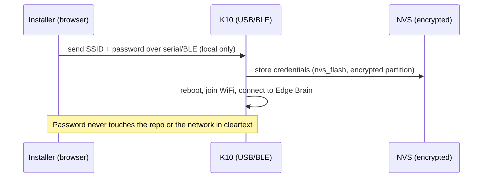

<!-- INTERNAL · IonityEdge · K10 · POL 986 AED -->

# Security & Data Sovereignty

> **Doc ID:** DOC-2026-07-K10-004 · Policy 986 AED

## 1. Secrets — the golden rule

**No real WiFi password, token, or key is ever committed to this public repo.**

| Where | What's committed | What's real |
|---|---|---|
| `firmware/arduino/include/secrets.example.h` | placeholders | — |
| `firmware/arduino/include/secrets.h` | **git-ignored** | your real values (local only) |
| Board NVS | — | provisioned by the installer at setup |
| `edge-server/.env` | **git-ignored** | brain config; `.env.example` committed |

The default network is **SSID `Antwerp Ionity`**. The password is entered **in the installer** and
written to the board's NVS — it is not stored in source. For a purely local build you may place it
in your own git-ignored `secrets.h` (copy from `secrets.example.h`).

## 2. Provisioning flow

## 3. Transport

- Device ↔ Brain WebSocket is **LAN-local** by default.
- Optional AES-GCM session encryption (pre-shared key set during provisioning) for hostile networks.
- Brain binds to the LAN interface; no port is exposed to the internet unless you choose to.

## 4. Data sovereignty (Policy 986)

- All captures, recordings, and cache entries are **stored locally** (LOCAL SAVED).
- No third-party telemetry or ad-tracking leaves the device or brain.
- Optional, explicit backup mirrors to OneDrive (`ai@ionity.today`) and Google Drive only.
- Sensitive cache entries are flagged and excluded from the ads/targeting surface.

## 5. Pre-commit checklist

- [ ] `secrets.h` and `.env` are git-ignored and absent from `git status`.
- [ ] No filled-in `WIFI_PASS "…"` in tracked files (only empty `""` or the example placeholder).
- [ ] `git ls-files` lists no `secrets.h` or `.env`.
- [ ] Brand marks used only on Ionity deliverables.

The CI job and `tools/push-to-github.*` enforce these automatically, without ever writing your
real password into a tracked file.

_© Ionity (Pty) Ltd · Policy 986 AED · CC BY-SA 4.0_
